# Generador_Simfiles_Hibrido

## ⚠️ ADVERTENCIA DE SEGURIDAD CRÍTICA (IMPORTANTE)
Este software trabaja directamente con la generación y modificación de archivos asociados.

Riesgo de Archivo: Dado que el programa está diseñado para crear, modificar y reescribir contenido rítmico basado en algoritmos avanzados, existe un riesgo inherente de "Falsos Positivos" de seguridad por el antivirus. Usa este programa considerando hacer respaldos de tus archivos.

## 🎶Guía de Usuario: Generador de Pasos Híbrido (StepMania)

Este programa está diseñado para generar archivos de pasos (*.sm y *.ssc) dinámicos y detallados, optimizados para juegos de ritmo como StepMania. Sigue esta guía para garantizar una instalación correcta y la mejor experiencia de uso posible.

### I. Requisitos Previos e Instalación Técnica

⚠️ Recomendaciones Importantes:

Se recomienda utilizar un entorno virtual (venv) para aislar las dependencias del proyecto, ya sea para probar el código o entrenar modelos.
El entorno base de prueba es Python 3.12 en WINDOWS 11, pero se espera compatibilidad con otras versiones de Python o Windows. 

**La versión ejecutable (.exe) con un checkpoint aparte se encuentra disponible si solo desea utilizar el generador.**

#### A. Dependencias Principales (Instalación vía pip)

Instalar dependencias esenciales

```bash
py -3.12 -m pip install librosa customtkinter
```

Para generar archivos ejecutables (.exe), instala pyinstaller:

```bash
py -3.12 -m pip install pyinstaller
```

⚡ ¡ATENCIÓN! VERSIONES CRÍTICAS DE TORCH (Para evitar conflictos con DLL en Windows)

```bash
py -3.12 -m pip install torch==2.8.0 torchvision==0.23.0
```

Para el creador de checkpoints, instalar tqdm:

```bash
py -3.12 -m pip install tqdm
```

### B. Flujo de Trabajo (Dos Etapas)

El proceso consta de dos fases obligatorias: 1) Crear los Checkpoints del modelo y 2) Generar los pasos con el generador principal.

#### Fase 1: Creación de Checkpoints IA (Obligatorio)

Antes de usar el generador, debes crear el modelo base utilizando la siguiente ruta. Recuerda cargar tus archivos .sm con música en carpetas dentro del directorio StepMania_Songs_Pack.

```bash
py -3.12 stepmania_pipeline.py
```

El archivo generado será guardado en una nueva carpeta llamada checkpoints, renombralo como step_transformer_model si deseas usar la función automática del generador.

#### Fase 2: Ejecución del Generador de Pasos

Una vez generados los checkpoints, puedes correr el generador principal. Por defecto, buscará un modelo llamado step_transformer_model.pt en la carpeta checkpoints, es opcional.

```bash
py -3.12 generador_simfiles_hibrido.py
```

## ⚙️ II. Interfaz y Parámetros de Configuración (Los 45 Controles)

La interfaz está dividida lógicamente para facilitar la generación, desde las entradas principales hasta los ajustes más detallados de ritmo y IA.

Actualización. Se mejoro la interfaz para hacerla más intuitiva y se agregaron opciones adicionales.

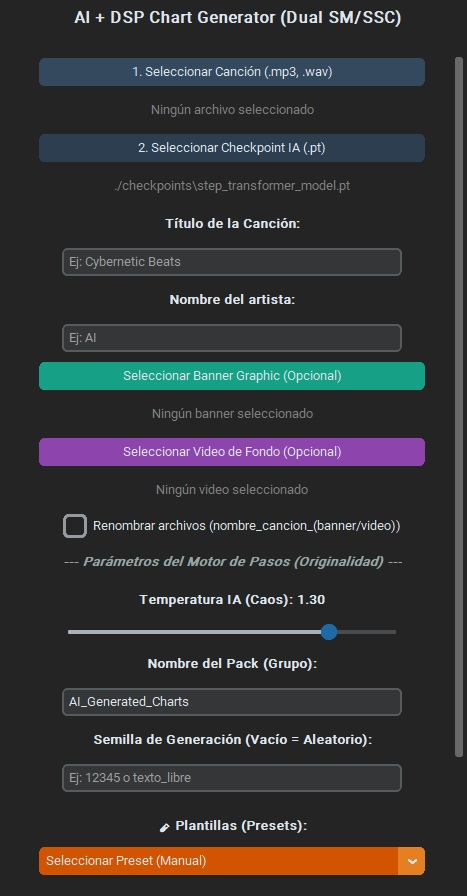
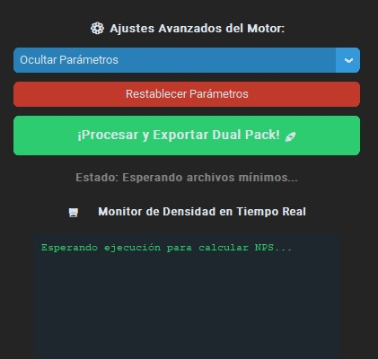

### A. Controles Básicos y Meta-Datos

Estos campos definen qué se va a generar.

| Nº | Campo | Tipo | Descripción | Notas Clave |
| :---: | :---: | :---: | :---: | :---: |
| 1 | **Seleccionar Canción** | Selector de Audio | Carga el archivo de audio que servirá como base para la creación de pasos. | Obligatorio. |
| 2	| **Seleccionar Checkpoint IA** |	Selector de Archivo | Carga el modelo (checkpoint) generado en la Fase 1.	| Obligatorio en esta versión del software. |
| 3	| **Título de la canción** | Texto | Nombre que se le asignará a tu pieza musical. Se usa para renombrar los archivos. | Sugerencia: Mantenerlo conciso. |
| 4 | **Nombre del artista** | Text | Nombra el artista de la canción | Opcional |
| 5, 6 | **Banner Graphic / Video de Fondo** | Selector Multimedia | Elementos opcionales para la presentación visual del track. | No afectan la generación de pasos, solo el output multimedia. |
| 7 | **Renombrar archivos** | Checkbox/Campo Op. |	Permite forzar el nombre del archivo de pasos con el título proporcionado. | Útil para organizar el pack final. |
| 8 | **Temperatura IA** |	Control Numérico | Determina cuán "libre" o creativa puede ser la Inteligencia Artificial al generar los pasos. | Un valor alto = más experimentación; bajo = más conservador y predecible. |
| 9 | **Nombre del Pack** | Texto | Nombra la carpeta en donde se almacenaran tus archivos. | Se reemplazo la función original ahora se copian los archivos de generación a este espacio. |
| 10 | **Semilla de Generación (Seed)**	| Número | Si introduces un número, el generador intentará crear exactamente los mismos pasos. | Guardar la semilla es útil para reproducir resultados perfectos o deseados. |
| 11 | **Plantillas** | Menú desplegable | Configuraciones para inspirarse o aplicar a tus pasos antes de generarlos. | Opcionales. Recordatorio, aplicar reset cada que quieras cambiar plantilla. |
| 12 | **Ocultar Parámetros** | Menú desplegable | Separa cada sector de modificadores en su propio apartado. | Usa este apartado para desplazarte al que quieras aplicar modificaciones. | 
| 13 | **Restablecer Parámetros** |	Botón | Limpia todos los campos y devuelve a sus valores predeterminados (por default).	| Recomendado si estás empezando desde cero. |
| 14 | **Procesar y Exportar Dual Pack** | Botón de Ejecución | Ejecuta todas las configuraciones establecidas para generar el archivo final de pasos (.sm, .ssc). | Acción principal al finalizar la configuración. |
| 15 | **Monitor de Densidad en Tiempo Real** | Consola | Proporciona una interpretación aproximada e inmediata del resultado rítmico que se está generando. | Sirve como un feedback visual mientras ajustas los parámetros. |

### B. Control Temporal y de Estructura  (Settings de Tiempo)

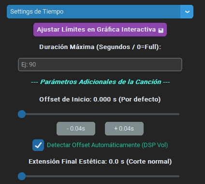
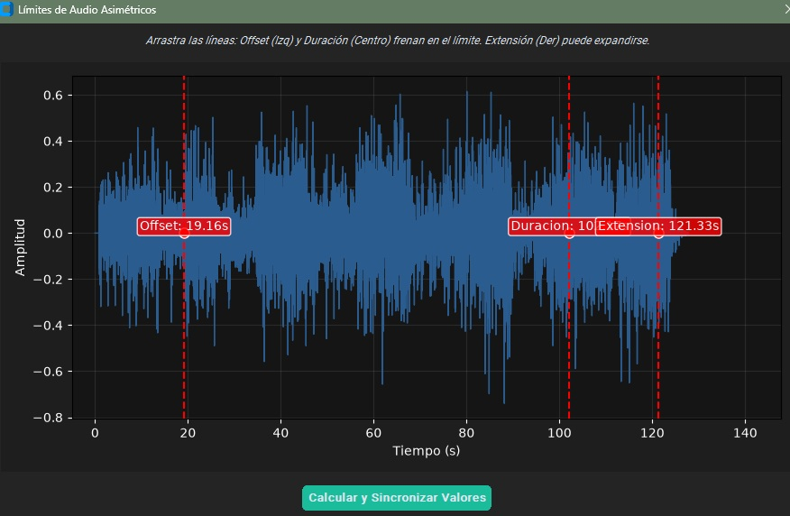

Determina cuánto va a durar el mapa de pasos y dónde debe empezar exactamente.

| Nº | Campo | Tipo | Descripción | Notas Clave |
| :---: | :---: | :---: | :---: | :---: |
| 16 | **Ajustar Límites en Gráfica Interactiva** | Botón e Interfaz | Despliega una gráfica para acoplar los valores de duración, offset y extensión de la canción. | Usalo si eres nuevo en estos temas. |
| 17 | **Calcular y Sincronizar Valores** | Botón | Aplica los valores de la gráfica a sus respectivos campos. | Importante si usas la interfaz gráfica (punto 16). | 
| 18 | **Duración Máxima** | Texto | Define el tiempo máximo que debe tener el archivo de pasos generado. |	Útil para recortar o limitar la extensión. |
| 19 | **Offset de Inicio** | Selector y botones | Permite definir manualmente el punto exacto donde debe comenzar la generación de pasos, distinto a la duración total. Se pueden ajustar con botones incrementales (-0.04s y +0.04s). | Útil si el inicio es silencioso o no rítmico. |
| 20 | **Detectar Offset Automáticamente** | Checkbox | Si está desactivado, debes especificar un offset manual (punto 15 y 16). | Se recomienda deshabilitar si se conoce el punto de inicio preciso. |
| 21 | **Extensión Final Estética** | Control Numérico | Permite extender el audio sin generar pasos rítmicos adicionales. | Ideal para escuchar la "desvanencia" final del track. |

### C. Análisis Rítmico y Velocidad Maestra (Configuración de BPM y Ritmo)

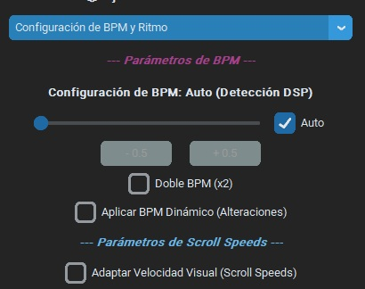
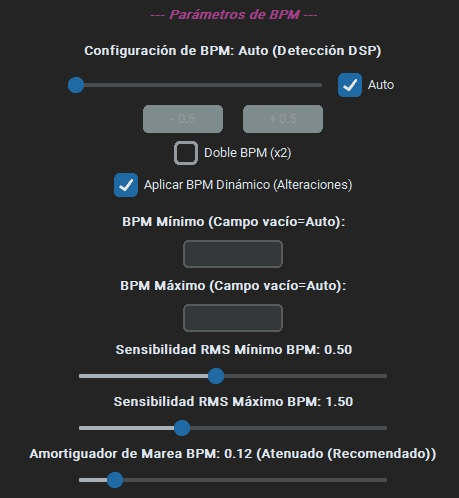
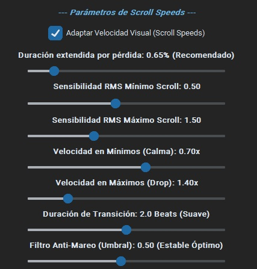

Controla el pulso y la velocidad de respuesta del generador basándose en el sonido. Es la sección más avanzada, ya que requiere entender cómo funciona un espectro de audio (RMS).

| Nº | Campo | Tipo | Descripción | Notas Clave |
| :---: | :---: | :---: | :---: | :---: |
| 22 | **Configuración BPM** | Control Numérico | Establece los pulsos por minuto (BPM) deseados. Se pueden ajustar con botones incrementales (1 en 1). | Define el ritmo base de la canción. |
| 23 | **Auto** | Checkbox | Habilita el calculo de BPM automático | Deshabilita si quieres aplicar un BPM manual. |
| 24 | **Doble BPM** | Checkbox | Si el resultado en el BPM automático o manual no es satisfactorio, puedes duplicar el BPM aquí antes de generar pasos. | Ajuste avanzado de ritmo. |
| 25 | **Aplicar BPM Dinámico** | Checkbox | Habilita un espectro basado en el RMS (lectura de picos altos y bajos de audio) para aplicar cambios de BPM. | Nueva opción. Ajuste avanzado de ritmo. |
| 26 | **BPM Mínimo** | Texto | Configura el BPM mínimo para la función dinámica (punto 24). | Ajuste avanzado de ritmo, opcional. En caso de no configurarlo se toma la siguiente medida BPM - 30 |
| 27 | **BPM Máximo** | Texto | Configura el BPM máximo para la función dinámica (punto 24). | Ajuste avanzado de ritmo, opcional. En caso de no configurarlo se toma la siguiente medida BPM + 30 |
| 28 | **Sensibilidad RMS Mínimo BPM** | Control Numérico |	Establece el parámetro mínimo (RMS) que debe tener una sección para ser considerada rítmicamente notable por la IA. | Avanzado. Impacto en secciones suaves. Especializado para el BPM. |
| 29 | **Sensibilidad RMS Máximo BPM** | Control Numérico |	Establece el parámetro mínimo (RMS) que define el pico de impacto rítmico más fuerte de la canción. | Avanzado. Impacto en picos intensos. Especializado para el BPM. |
| 30 | **Amortiguador de Marea BPM** | Control Numérico | Establece el valor de aproximación a los cambios de BPM. | Entre más alto más brusco y exacto es el cambio de BPM pero puede causar mareo o distorsiones. |
| 31 | **Adaptar Velocidad Visual** | Checkbox | Habilita un espectro basado en el RMS (lectura de picos altos y bajos de audio) para aplicar cambios de velocidad. | Nueva opción. Función experimental. Ajuste avanzado de ritmo. Activar esta opción requerira un ajuste manual por parte del usuario. |
| 32 | **Duración extendida por pérdida** | Control Numérico | Establece un reajuste en la duración del mapa al aplicar cambios de velocidad. | Avanzado. Requiere que el usuario verifique este valor para que se abarque la duración esperada de la canción. |
| 33 | **Sensibilidad RMS Mínimo Scroll** | Control Numérico |	Establece el parámetro mínimo (RMS) que debe tener una sección para ser considerada rítmicamente notable por la IA. | Avanzado. Impacto en secciones suaves. Especializado para el scroll speed. |
| 34 | **Sensibilidad RMS Máximo Scroll** | Control Numérico |	Establece el parámetro mínimo (RMS) que define el pico de impacto rítmico más fuerte de la canción. | Avanzado. Impacto en picos intensos. Especializado para el scroll speed. |
| 35 | **Velocidad en Mínimos** | Control Numérico | Establece el parámetro de velocidad mínima que se aplica en el punto más bajo de RMS | Avanzado. Impacto en velocidad. |
| 36 | **Velocidad en Máximos** | Control Numérico | Establece el parámetro de velocidad máxima que se aplica en el punto más alto de RMS | Avanzado. Impacto en velocidad. |
| 37 | **Duración transición** | Control Numérico |	Determina cuánto tiempo tardará la herramienta en reajustar la velocidad cuando se usa "Adaptar Velocidad Visual" (punto 31). | Controla la suavidad del cambio de ritmo. |
| 38 | **Filtro Anti-Mareo** | Control Numérico | Estable el umbral para que se aplique un cambio de velocidad. | Avanzado. Entre más alto el valor más estable el cambio de velocidad, entre más bajo puede producir cortes bruscos y mareo. |

### D. Elementos Especiales y Complejidad (Efectos, Minas y Trampas)

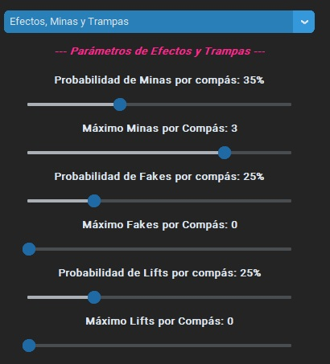
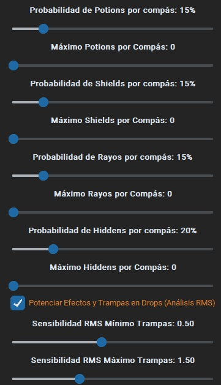

Permiten añadir elementos específicos del género de juegos de ritmo para aumentar la complejidad y la variación.

| Nº | Campo | Tipo | Descripción | Notas Clave |
| :---: | :---: | :---: | :---: | :---: |
| 39 - 53 |	**(Minas, Fakes, Lifts, Potions, Shields, Rayos, Hiddens)** | Probabilidad / Máximo Control Numérico | Cada uno de estos grupos controla la probabilidad y el número máximo de un efecto específico por compás generado. | Estos son ajustes muy finos para crear patrones específicos (ej: si quieres muchas trampas/minas). |
| 54 | **Potenciar Efectos y Trampas** | Checkbox |	Activar este campo aplica efectos especiales avanzados a los pasos generados por IA. | Uso avanzado, mejora el realismo rítmico. Obligatorio para aplicar las trampas. |
| 55 | **Sensibilidad RMS Mínimo Trampas** | Control Numérico |	Establece el parámetro mínimo (RMS) que debe tener una sección para ser considerada rítmicamente notable por la IA. | Avanzado. Impacto en secciones suaves. Especializado para las trampas. |
| 56 | **Sensibilidad RMS Máximo Trampas** | Control Numérico |	Establece el parámetro mínimo (RMS) que define el pico de impacto rítmico más fuerte de la canción. | Avanzado. Impacto en picos intensos. Especializado para las trampas. |

### E. Ajustes de Dificultad y Densidad de Notas (Filtros Espectrales y Dificultad)

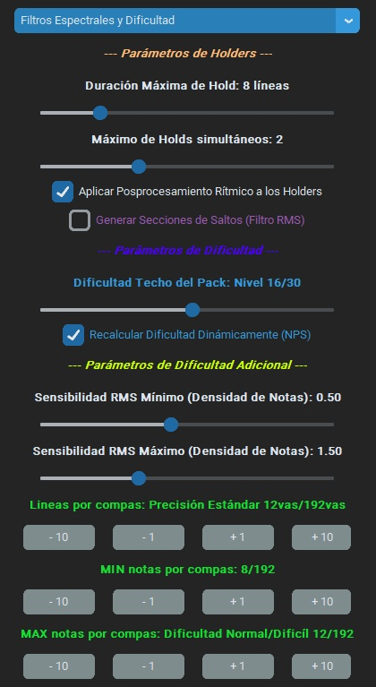
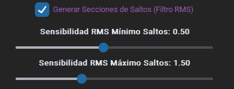

Controla la calidad y severidad del patrón rítmico generado. Se centra en las notas individuales y los movimientos corporales simulados.

| Nº | Campo | Tipo | Descripción | Notas Clave |
| :---: | :---: | :---: | :---: | :---: |
| 57 | **Duración Máxima de Holds** | Control Numérico | Define el tiempo máximo que puede mantener un paso sostenido (Hold). | Controla la duración de las notas largas. |
| 58 | **Máximo de Holds Simultáneos** | Control Numérico |	Determina cuántos pasos sostenidos pueden ocurrir al mismo tiempo. | Ideal para quitar o aumentar complejidad en zonas específicas. |
| 59 | **Aplicar Posprocesamiento rítmico** | Checkbox | Mejora el resultado bruto de la IA mediante efectos adicionales. Desactivarlo produce un resultado "en crudo" en los holds. | Recomendado activarlo para mejor calidad. |
| 60 | **Generar Secciones de Saltos** | Checkbox | Habilita la opción de agregar más secciones de saltos. | Usalo si no estas conforme con los saltos. Recordatorio, bajar la duración de los holds. |
| 61 | **Sensibilidad RMS Mínimo Saltos** | Control Numérico | Establece el parámetro mínimo (RMS) que debe tener una sección para ser considerada rítmicamente notable por la IA. | Avanzado. Impacto en secciones suaves. Especializado para los saltos. |
| 62 | **Sensibilidad RMS Máximo Saltos** | Control Numérico | Establece el parámetro mínimo (RMS) que define el pico de impacto rítmico más fuerte de la canción. | Avanzado. Impacto en picos intensos. Especializado para los saltos. |
| 63 | **Dificultad Techo del Pack** | Control Numérico | Define el nivel general de dificultad deseado para todo el pack de pasos. Se usa en el recálculo de dificultad (Punto 64). | Establece la intención artística del resultado final. |
| 64 | **Recalcular Dificultad Dinámicamente** | Checkbox/Op. | Permite recalcular la dificultad basándose en las elecciones manuales de usuario (ej: BPM, Scroll Min/Max). | Si se desactiva, se usa una configuración fija. |
| 65 | **Sensibilidad RMS Mínimo (Densidad de Notas)** | Control Numérico |	Establece el parámetro mínimo (RMS) que debe tener una sección para ser considerada rítmicamente notable por la IA. | Avanzado. Impacto en secciones suaves. Especializado para las notas. |
| 66 | **Sensibilidad RMS Máximo (Densidad de Notas)** | Control Numérico |	Establece el parámetro mínimo (RMS) que define el pico de impacto rítmico más fuerte de la canción. | Avanzado. Impacto en picos intensos. Especializado para las notas. |
| 67 | **Lineas por compas** | Botones | Aumenta las divisiones al momento de dibujar la notas. | Avanzado. Impacto en la complejidad y dificultad del resultado final. |
| 68 | **MIN notas por compas** | Botones | Número mínimo de notas que se dibujaran considerado en RMS bajo. | Avanzado. Impacto alto en dificultad. Función experimental. |
| 69 | **MAX notas por compas** | Botones | Número máximo de notas que se dibujaran considerado en RMS alto. | Avanzado. Impacto alto en dificultad. Función experimental. |
